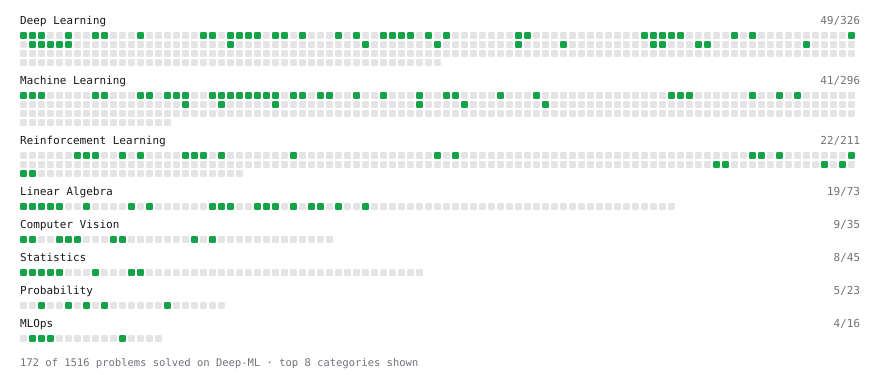

# Deep-ML

My machine learning practice from [Deep-ML](https://www.deep-ml.com). Every solution here was written by hand.

**170** solved · 170 problems · 0 labs · 0 math

[**Browse the interactive portfolio**](https://WiktorZoga.github.io/deep-ml/) to replay this filling in over time.

## Problems

| | Difficulty | Solved | |
| --- | --- | --- | --- |
| [Adagrad Optimizer](https://www.deep-ml.com/problems/145) | easy | 2026-10-02 | [solution](problems/0145-adagrad-optimizer) |
| [Adamax Optimizer](https://www.deep-ml.com/problems/148) | easy | 2026-10-02 | [solution](problems/0148-adamax-optimizer) |
| [Analyzing Memory Fragmentation in LLM Serving](https://www.deep-ml.com/problems/495) | easy | 2026-10-03 | [solution](problems/0495-analyzing-memory-fragmentation-in-llm-serving) |
| [Apply Zero Padding to an Image](https://www.deep-ml.com/problems/239) | easy | 2026-10-03 | [solution](problems/0239-apply-zero-padding-to-an-image) |
| [Auto-Sized MLP from Gym Spaces](https://www.deep-ml.com/problems/673) | easy | 2026-10-07 | [solution](problems/0673-auto-sized-mlp-from-gym-spaces) |
| [Autoregressive Video Chunk FPS Calculator](https://www.deep-ml.com/problems/454) | easy | 2026-10-03 | [solution](problems/0454-autoregressive-video-chunk-fps-calculator) |
| [Batch Iterator for Dataset](https://www.deep-ml.com/problems/30) | easy | 2026-10-02 | [solution](problems/0030-batch-iterator-for-dataset) |
| [Bernoulli Masking Schedule for Masked Token Prediction](https://www.deep-ml.com/problems/708) | easy | 2026-10-07 | [solution](problems/0708-bernoulli-masking-schedule-for-masked-token-prediction) |
| [Bhattacharyya Distance Between Two Distributions](https://www.deep-ml.com/problems/120) | easy | 2026-10-02 | [solution](problems/0120-bhattacharyya-distance-between-two-distributions) |
| [Binary Classification with Logistic Regression](https://www.deep-ml.com/problems/104) | easy | 2026-10-02 | [solution](problems/0104-binary-classification-with-logistic-regression) |
| [Build a Multi-Armed Bandit Testbed](https://www.deep-ml.com/problems/542) | easy | 2026-10-03 | [solution](problems/0542-build-a-multi-armed-bandit-testbed) |
| [Calculate 2x2 Matrix Inverse](https://www.deep-ml.com/problems/8) | easy | 2026-10-02 | [solution](problems/0008-calculate-2x2-matrix-inverse) |
| [Calculate Accuracy Score](https://www.deep-ml.com/problems/36) | easy | 2026-10-02 | [solution](problems/0036-calculate-accuracy-score) |
| [Calculate Batch Prediction Health Metrics](https://www.deep-ml.com/problems/249) | easy | 2026-10-03 | [solution](problems/0249-calculate-batch-prediction-health-metrics) |
| [Calculate Computational Efficiency of MoE](https://www.deep-ml.com/problems/123) | easy | 2026-10-02 | [solution](problems/0123-calculate-computational-efficiency-of-moe) |
| [Calculate Conditional Probability from Data](https://www.deep-ml.com/problems/168) | easy | 2026-10-03 | [solution](problems/0168-calculate-conditional-probability-from-data) |
| [Calculate Cosine Similarity Between Vectors](https://www.deep-ml.com/problems/76) | easy | 2026-10-02 | [solution](problems/0076-calculate-cosine-similarity-between-vectors) |
| [Calculate Covariance Matrix](https://www.deep-ml.com/problems/10) | easy | 2026-10-02 | [solution](problems/0010-calculate-covariance-matrix) |
| [Calculate Dice Score for Classification](https://www.deep-ml.com/problems/73) | easy | 2026-10-02 | [solution](problems/0073-calculate-dice-score-for-classification) |
| [Calculate F1 Score from Predicted and True Labels](https://www.deep-ml.com/problems/91) | easy | 2026-10-02 | [solution](problems/0091-calculate-f1-score-from-predicted-and-true-labels) |
| [Calculate Image Brightness](https://www.deep-ml.com/problems/70) | easy | 2026-10-02 | [solution](problems/0070-calculate-image-brightness) |
| [Calculate Jaccard Index for Binary Classification](https://www.deep-ml.com/problems/72) | easy | 2026-10-02 | [solution](problems/0072-calculate-jaccard-index-for-binary-classification) |
| [Calculate Mean Absolute Error (MAE)](https://www.deep-ml.com/problems/93) | easy | 2026-10-02 | [solution](problems/0093-calculate-mean-absolute-error-mae) |
| [Calculate Mean by Row or Column](https://www.deep-ml.com/problems/4) | easy | 2026-10-02 | [solution](problems/0004-calculate-mean-by-row-or-column) |
| [Calculate Model Inference Statistics for Monitoring](https://www.deep-ml.com/problems/248) | easy | 2026-10-03 | [solution](problems/0248-calculate-model-inference-statistics-for-monitoring) |
| [Calculate Number of Parameters in Neural Network](https://www.deep-ml.com/problems/371) | easy | 2026-10-03 | [solution](problems/0371-calculate-number-of-parameters-in-neural-network) |
| [Calculate P50/P95/P99 Latency Percentiles](https://www.deep-ml.com/problems/293) | easy | 2026-10-03 | [solution](problems/0293-calculate-p50-p95-p99-latency-percentiles) |
| [Calculate Perplexity for Language Models](https://www.deep-ml.com/problems/320) | easy | 2026-10-03 | [solution](problems/0320-calculate-perplexity-for-language-models) |
| [Calculate Portfolio Variance](https://www.deep-ml.com/problems/183) | easy | 2026-10-03 | [solution](problems/0183-calculate-portfolio-variance) |
| [Calculate R-squared for Regression Analysis](https://www.deep-ml.com/problems/69) | easy | 2026-10-02 | [solution](problems/0069-calculate-r-squared-for-regression-analysis) |
| [Calculate Root Mean Square Error (RMSE)](https://www.deep-ml.com/problems/71) | easy | 2026-10-02 | [solution](problems/0071-calculate-root-mean-square-error-rmse) |
| [Calculate SLA Compliance Metrics for Model Service](https://www.deep-ml.com/problems/250) | easy | 2026-10-03 | [solution](problems/0250-calculate-sla-compliance-metrics-for-model-service) |
| [Calculate SVM Margin Width](https://www.deep-ml.com/problems/282) | easy | 2026-10-03 | [solution](problems/0282-calculate-svm-margin-width) |
| [Calculate the Discounted Return for a Given Trajectory](https://www.deep-ml.com/problems/167) | easy | 2026-10-03 | [solution](problems/0167-calculate-the-discounted-return-for-a-given-trajectory) |
| [Calculate the Phi Coefficient](https://www.deep-ml.com/problems/95) | easy | 2026-10-02 | [solution](problems/0095-calculate-the-phi-coefficient) |
| [Calculate Unigram Probability from Corpus](https://www.deep-ml.com/problems/129) | easy | 2026-10-02 | [solution](problems/0129-calculate-unigram-probability-from-corpus) |
| [Character-Level Tokenizer (stoi/itos/BOS)](https://www.deep-ml.com/problems/374) | easy | 2026-10-03 | [solution](problems/0374-character-level-tokenizer-stoi-itos-bos) |
| [Check Linear Independence of Vectors](https://www.deep-ml.com/problems/331) | easy | 2026-10-03 | [solution](problems/0331-check-linear-independence-of-vectors) |
| [Compare Update Strategies in Policy Evaluation](https://www.deep-ml.com/problems/545) | easy | 2026-10-03 | [solution](problems/0545-compare-update-strategies-in-policy-evaluation) |
| [Compute Arithmetic Intensity and Classify Bottleneck](https://www.deep-ml.com/problems/414) | easy | 2026-10-03 | [solution](problems/0414-compute-arithmetic-intensity-and-classify-bottleneck) |
| [Compute Discounted Return](https://www.deep-ml.com/problems/165) | easy | 2026-10-03 | [solution](problems/0165-compute-discounted-return) |
| [Compute Multi-class Cross-Entropy Loss](https://www.deep-ml.com/problems/134) | easy | 2026-10-02 | [solution](problems/0134-compute-multi-class-cross-entropy-loss) |
| [Compute Posterior Probability using Bayes' Theorem](https://www.deep-ml.com/problems/336) | easy | 2026-10-03 | [solution](problems/0336-compute-posterior-probability-using-bayes-theorem) |
| [Compute Temporal Difference Error](https://www.deep-ml.com/problems/257) | easy | 2026-10-03 | [solution](problems/0257-compute-temporal-difference-error) |
| [Compute the Cross Product of Two 3D Vectors](https://www.deep-ml.com/problems/118) | easy | 2026-10-02 | [solution](problems/0118-compute-the-cross-product-of-two-3d-vectors) |
| [Compute TTFT ITL and TPS from a Token Timestamp Stream](https://www.deep-ml.com/problems/411) | easy | 2026-10-03 | [solution](problems/0411-compute-ttft-itl-and-tps-from-a-token-timestamp-stream) |
| [Convert RGB Image to Grayscale](https://www.deep-ml.com/problems/237) | easy | 2026-10-03 | [solution](problems/0237-convert-rgb-image-to-grayscale) |
| [Convert Vector to Diagonal Matrix](https://www.deep-ml.com/problems/35) | easy | 2026-10-02 | [solution](problems/0035-convert-vector-to-diagonal-matrix) |
| [Demonstrate Law of Large Numbers with Sampling](https://www.deep-ml.com/problems/342) | easy | 2026-10-03 | [solution](problems/0342-demonstrate-law-of-large-numbers-with-sampling) |
| [Derivative of a Polynomial](https://www.deep-ml.com/problems/116) | easy | 2026-10-02 | [solution](problems/0116-derivative-of-a-polynomial) |
| [Derivatives of Activation Functions](https://www.deep-ml.com/problems/217) | easy | 2026-10-03 | [solution](problems/0217-derivatives-of-activation-functions) |
| [Descriptive Statistics Calculator](https://www.deep-ml.com/problems/78) | easy | 2026-10-02 | [solution](problems/0078-descriptive-statistics-calculator) |
| [Detect Overfitting or Underfitting](https://www.deep-ml.com/problems/86) | easy | 2026-10-02 | [solution](problems/0086-detect-overfitting-or-underfitting) |
| [Dot Product Calculator](https://www.deep-ml.com/problems/83) | easy | 2026-10-02 | [solution](problems/0083-dot-product-calculator) |
| [DQN NatureCNN Architecture Analysis](https://www.deep-ml.com/problems/672) | easy | 2026-10-07 | [solution](problems/0672-dqn-naturecnn-architecture-analysis) |
| [Dynamic Tanh: Normalization-Free Transformer Activation](https://www.deep-ml.com/problems/128) | easy | 2026-10-02 | [solution](problems/0128-dynamic-tanh-normalization-free-transformer-activation) |
| [Early Stopping Based on Validation Loss Plateau](https://www.deep-ml.com/problems/199) | easy | 2026-10-03 | [solution](problems/0199-early-stopping-based-on-validation-loss-plateau) |
| [Empirical Probability Mass Function (PMF)](https://www.deep-ml.com/problems/184) | easy | 2026-10-03 | [solution](problems/0184-empirical-probability-mass-function-pmf) |
| [Episodic Info Dictionary Aggregation](https://www.deep-ml.com/problems/665) | easy | 2026-10-07 | [solution](problems/0665-episodic-info-dictionary-aggregation) |
| [Estimate Action Values Using Sample Averaging](https://www.deep-ml.com/problems/543) | easy | 2026-10-03 | [solution](problems/0543-estimate-action-values-using-sample-averaging) |
| [Estimate Minimum GPU Count for Model Deployment](https://www.deep-ml.com/problems/412) | easy | 2026-10-03 | [solution](problems/0412-estimate-minimum-gpu-count-for-model-deployment) |
| [Exact Match Score with Normalization](https://www.deep-ml.com/problems/325) | easy | 2026-10-03 | [solution](problems/0325-exact-match-score-with-normalization) |
| [Expected Value and Variance of an n-Sided Die](https://www.deep-ml.com/problems/179) | easy | 2026-10-03 | [solution](problems/0179-expected-value-and-variance-of-an-n-sided-die) |
| [Exponential Distribution PDF and CDF](https://www.deep-ml.com/problems/340) | easy | 2026-10-03 | [solution](problems/0340-exponential-distribution-pdf-and-cdf) |
| [Exponential Moving Average (EMA) for Diffusion Model Weights](https://www.deep-ml.com/problems/401) | easy | 2026-10-03 | [solution](problems/0401-exponential-moving-average-ema-for-diffusion-model-weights) |
| [Exponential Weighted Average of Rewards](https://www.deep-ml.com/problems/161) | easy | 2026-10-02 | [solution](problems/0161-exponential-weighted-average-of-rewards) |
| [ExponentialLR Learning Rate Scheduler](https://www.deep-ml.com/problems/154) | easy | 2026-10-02 | [solution](problems/0154-exponentiallr-learning-rate-scheduler) |
| [Feature Scaling Implementation](https://www.deep-ml.com/problems/16) | easy | 2026-10-02 | [solution](problems/0016-feature-scaling-implementation) |
| [First Frame Anchor Noise Injection](https://www.deep-ml.com/problems/460) | easy | 2026-10-03 | [solution](problems/0460-first-frame-anchor-noise-injection) |
| [Flip an Image Horizontally or Vertically](https://www.deep-ml.com/problems/238) | easy | 2026-10-03 | [solution](problems/0238-flip-an-image-horizontally-or-vertically) |
| [GeLU Activation Function ](https://www.deep-ml.com/problems/147) | easy | 2026-10-02 | [solution](problems/0147-gelu-activation-function) |
| [Generate a Confusion Matrix for Binary Classification](https://www.deep-ml.com/problems/75) | easy | 2026-10-02 | [solution](problems/0075-generate-a-confusion-matrix-for-binary-classification) |
| [Gibbs Softmax Action Selection](https://www.deep-ml.com/problems/641) | easy | 2026-10-05 | [solution](problems/0641-gibbs-softmax-action-selection) |
| [GPU Ops:Byte Ratio Calculation from Spec Sheet](https://www.deep-ml.com/problems/421) | easy | 2026-10-03 | [solution](problems/0421-gpu-ops-byte-ratio-calculation-from-spec-sheet) |
| [Gradient Checkpointing](https://www.deep-ml.com/problems/188) | easy | 2026-10-03 | [solution](problems/0188-gradient-checkpointing) |
| [Gradient Direction and Magnitude](https://www.deep-ml.com/problems/308) | easy | 2026-10-03 | [solution](problems/0308-gradient-direction-and-magnitude) |
| [Grayscale Image Contrast Calculator](https://www.deep-ml.com/problems/82) | easy | 2026-10-02 | [solution](problems/0082-grayscale-image-contrast-calculator) |
| [Group Relative Advantage for GRPO](https://www.deep-ml.com/problems/224) | easy | 2026-10-03 | [solution](problems/0224-group-relative-advantage-for-grpo) |
| [Gym/Gymnasium API Migration Layer](https://www.deep-ml.com/problems/667) | easy | 2026-10-07 | [solution](problems/0667-gym-gymnasium-api-migration-layer) |
| [Hamming Distance for Kanerva Coding](https://www.deep-ml.com/problems/647) | easy | 2026-10-05 | [solution](problems/0647-hamming-distance-for-kanerva-coding) |
| [Historical Context Compression Ratio](https://www.deep-ml.com/problems/455) | easy | 2026-10-03 | [solution](problems/0455-historical-context-compression-ratio) |
| [Image Patch Embedding and Reconstruction](https://www.deep-ml.com/problems/705) | easy | 2026-10-07 | [solution](problems/0705-image-patch-embedding-and-reconstruction) |
| [Implement 2D Average Pooling](https://www.deep-ml.com/problems/265) | easy | 2026-10-03 | [solution](problems/0265-implement-2d-average-pooling) |
| [Implement a Simple Residual Block with Shortcut Connection](https://www.deep-ml.com/problems/113) | easy | 2026-10-02 | [solution](problems/0113-implement-a-simple-residual-block-with-shortcut-connection) |
| [Implement Binary Cross-Entropy Loss](https://www.deep-ml.com/problems/263) | easy | 2026-10-03 | [solution](problems/0263-implement-binary-cross-entropy-loss) |
| [Implement Compressed Column Sparse Matrix Format (CSC)](https://www.deep-ml.com/problems/67) | easy | 2026-10-02 | [solution](problems/0067-implement-compressed-column-sparse-matrix-format-csc) |
| [Implement Compressed Row Sparse Matrix (CSR) Format Conversion](https://www.deep-ml.com/problems/65) | easy | 2026-10-02 | [solution](problems/0065-implement-compressed-row-sparse-matrix-csr-format-conversion) |
| [Implement Early Stopping Based on Validation Loss](https://www.deep-ml.com/problems/135) | easy | 2026-10-02 | [solution](problems/0135-implement-early-stopping-based-on-validation-loss) |
| [Implement F-Score Calculation for Binary Classification](https://www.deep-ml.com/problems/61) | easy | 2026-10-02 | [solution](problems/0061-implement-f-score-calculation-for-binary-classification) |
| [Implement Gini Impurity Calculation for a Set of Classes](https://www.deep-ml.com/problems/64) | easy | 2026-10-02 | [solution](problems/0064-implement-gini-impurity-calculation-for-a-set-of-classes) |
| [Implement Global Average Pooling](https://www.deep-ml.com/problems/114) | easy | 2026-10-02 | [solution](problems/0114-implement-global-average-pooling) |
| [Implement Gradient Clipping by Value](https://www.deep-ml.com/problems/292) | easy | 2026-10-03 | [solution](problems/0292-implement-gradient-clipping-by-value) |
| [Implement Hard Voting Classifier](https://www.deep-ml.com/problems/305) | easy | 2026-10-03 | [solution](problems/0305-implement-hard-voting-classifier) |
| [Implement He Weight Initialization](https://www.deep-ml.com/problems/290) | easy | 2026-10-03 | [solution](problems/0290-implement-he-weight-initialization) |
| [Implement Hinge Loss for SVM](https://www.deep-ml.com/problems/283) | easy | 2026-10-03 | [solution](problems/0283-implement-hinge-loss-for-svm) |
| [Implement Orthogonal Projection of a Vector onto a Line](https://www.deep-ml.com/problems/66) | easy | 2026-10-02 | [solution](problems/0066-implement-orthogonal-projection-of-a-vector-onto-a-line) |
| [Implement Polynomial Kernel Function](https://www.deep-ml.com/problems/281) | easy | 2026-10-03 | [solution](problems/0281-implement-polynomial-kernel-function) |
| [Implement Precision Metric](https://www.deep-ml.com/problems/46) | easy | 2026-10-02 | [solution](problems/0046-implement-precision-metric) |
| [Implement Recall Metric in Binary Classification](https://www.deep-ml.com/problems/52) | easy | 2026-10-02 | [solution](problems/0052-implement-recall-metric-in-binary-classification) |
| [Implement ReLU Activation Function](https://www.deep-ml.com/problems/42) | easy | 2026-10-02 | [solution](problems/0042-implement-relu-activation-function) |
| [Implement Ridge Regression Loss Function](https://www.deep-ml.com/problems/43) | easy | 2026-10-02 | [solution](problems/0043-implement-ridge-regression-loss-function) |
| [Implement RMSNorm (Root Mean Square Layer Normalization)](https://www.deep-ml.com/problems/372) | easy | 2026-10-03 | [solution](problems/0372-implement-rmsnorm-root-mean-square-layer-normalization) |
| [Implement SwiGLU activation function](https://www.deep-ml.com/problems/156) | easy | 2026-10-02 | [solution](problems/0156-implement-swiglu-activation-function) |
| [Implement the ELU Activation Function](https://www.deep-ml.com/problems/97) | easy | 2026-10-02 | [solution](problems/0097-implement-the-elu-activation-function) |
| [Implement the Hard Sigmoid Activation Function](https://www.deep-ml.com/problems/96) | easy | 2026-10-02 | [solution](problems/0096-implement-the-hard-sigmoid-activation-function) |
| [Implement the Hardtanh Activation Function](https://www.deep-ml.com/problems/266) | easy | 2026-10-03 | [solution](problems/0266-implement-the-hardtanh-activation-function) |
| [Implement the Mish Activation Function](https://www.deep-ml.com/problems/262) | easy | 2026-10-03 | [solution](problems/0262-implement-the-mish-activation-function) |
| [Implement the SELU Activation Function](https://www.deep-ml.com/problems/103) | easy | 2026-10-02 | [solution](problems/0103-implement-the-selu-activation-function) |
| [Implement the Softplus Activation Function](https://www.deep-ml.com/problems/99) | easy | 2026-10-02 | [solution](problems/0099-implement-the-softplus-activation-function) |
| [Implement the Softsign Activation Function](https://www.deep-ml.com/problems/100) | easy | 2026-10-02 | [solution](problems/0100-implement-the-softsign-activation-function) |
| [Implement the Square ReLU Activation Function](https://www.deep-ml.com/problems/373) | easy | 2026-10-03 | [solution](problems/0373-implement-the-square-relu-activation-function) |
| [Implement the Swish Activation Function](https://www.deep-ml.com/problems/102) | easy | 2026-10-02 | [solution](problems/0102-implement-the-swish-activation-function) |
| [Implement the Tanh Activation Function](https://www.deep-ml.com/problems/264) | easy | 2026-10-03 | [solution](problems/0264-implement-the-tanh-activation-function) |
| [Implement Weight Decay as L2 Regularization](https://www.deep-ml.com/problems/198) | easy | 2026-10-03 | [solution](problems/0198-implement-weight-decay-as-l2-regularization) |
| [Implement Xavier/Glorot Weight Initialization](https://www.deep-ml.com/problems/369) | easy | 2026-10-03 | [solution](problems/0369-implement-xavier-glorot-weight-initialization) |
| [Implementation of Log Softmax Function](https://www.deep-ml.com/problems/39) | easy | 2026-10-02 | [solution](problems/0039-implementation-of-log-softmax-function) |
| [Incremental Mean for Online Reward Estimation](https://www.deep-ml.com/problems/159) | easy | 2026-10-02 | [solution](problems/0159-incremental-mean-for-online-reward-estimation) |
| [IPC Methods Performance Comparison](https://www.deep-ml.com/problems/671) | easy | 2026-10-07 | [solution](problems/0671-ipc-methods-performance-comparison) |
| [KL Divergence Between Two Normal Distributions](https://www.deep-ml.com/problems/56) | easy | 2026-10-02 | [solution](problems/0056-kl-divergence-between-two-normal-distributions) |
| [KL Divergence Estimator for GRPO](https://www.deep-ml.com/problems/225) | easy | 2026-10-03 | [solution](problems/0225-kl-divergence-estimator-for-grpo) |
| [Label Encoding for Ordinal Variables](https://www.deep-ml.com/problems/356) | easy | 2026-10-03 | [solution](problems/0356-label-encoding-for-ordinal-variables) |
| [Leaky ReLU Activation Function](https://www.deep-ml.com/problems/44) | easy | 2026-10-02 | [solution](problems/0044-leaky-relu-activation-function) |
| [Learned Positional Embeddings](https://www.deep-ml.com/problems/375) | easy | 2026-10-03 | [solution](problems/0375-learned-positional-embeddings) |
| [Linear Kernel Function](https://www.deep-ml.com/problems/45) | easy | 2026-10-02 | [solution](problems/0045-linear-kernel-function) |
| [Linear Learning Rate Decay](https://www.deep-ml.com/problems/377) | easy | 2026-10-03 | [solution](problems/0377-linear-learning-rate-decay) |
| [Linear Regression Using Gradient Descent](https://www.deep-ml.com/problems/15) | easy | 2026-10-02 | [solution](problems/0015-linear-regression-using-gradient-descent) |
| [Linear Regression Using Normal Equation](https://www.deep-ml.com/problems/14) | easy | 2026-10-02 | [solution](problems/0014-linear-regression-using-normal-equation) |
| [Logit-Normal Sampling for Diffusion Timesteps](https://www.deep-ml.com/problems/696) | easy | 2026-10-07 | [solution](problems/0696-logit-normal-sampling-for-diffusion-timesteps) |
| [Matrix Determinant & Trace](https://www.deep-ml.com/problems/195) | easy | 2026-10-03 | [solution](problems/0195-matrix-determinant-trace) |
| [Matrix-Vector Dot Product](https://www.deep-ml.com/problems/1) | easy | 2026-10-02 | [solution](problems/0001-matrix-vector-dot-product) |
| [Measure Disorder in Apple Colors](https://www.deep-ml.com/problems/108) | easy | 2026-10-02 | [solution](problems/0108-measure-disorder-in-apple-colors) |
| [Min-Max Scaling of Feature Values](https://www.deep-ml.com/problems/112) | easy | 2026-10-02 | [solution](problems/0112-min-max-scaling-of-feature-values) |
| [Momentum Optimizer](https://www.deep-ml.com/problems/146) | easy | 2026-10-02 | [solution](problems/0146-momentum-optimizer) |
| [Multi-Agent Data Canonicalization](https://www.deep-ml.com/problems/663) | easy | 2026-10-05 | [solution](problems/0663-multi-agent-data-canonicalization) |
| [Multi-Signal Conditioning for Diffusion Transformers](https://www.deep-ml.com/problems/694) | easy | 2026-10-07 | [solution](problems/0694-multi-signal-conditioning-for-diffusion-transformers) |
| [Nesterov Accelerated Gradient Optimizer](https://www.deep-ml.com/problems/150) | easy | 2026-10-02 | [solution](problems/0150-nesterov-accelerated-gradient-optimizer) |
| [One-Hot Encoding of Nominal Values](https://www.deep-ml.com/problems/34) | easy | 2026-10-02 | [solution](problems/0034-one-hot-encoding-of-nominal-values) |
| [Optimal Policy Extraction from Q-Values](https://www.deep-ml.com/problems/466) | easy | 2026-10-03 | [solution](problems/0466-optimal-policy-extraction-from-q-values) |
| [Optimistic Initialization for Exploration](https://www.deep-ml.com/problems/509) | easy | 2026-10-03 | [solution](problems/0509-optimistic-initialization-for-exploration) |
| [Pass@k and Majority Voting Evaluation Metrics](https://www.deep-ml.com/problems/226) | easy | 2026-10-03 | [solution](problems/0226-pass-k-and-majority-voting-evaluation-metrics) |
| [Phi Transformation for Polynomial Features](https://www.deep-ml.com/problems/84) | easy | 2026-10-02 | [solution](problems/0084-phi-transformation-for-polynomial-features) |
| [Ply-Based Value Discounting](https://www.deep-ml.com/problems/640) | easy | 2026-10-05 | [solution](problems/0640-ply-based-value-discounting) |
| [Poisson Distribution Probability Calculator](https://www.deep-ml.com/problems/81) | easy | 2026-10-02 | [solution](problems/0081-poisson-distribution-probability-calculator) |
| [Prefix Cache Hit Rate Calculator](https://www.deep-ml.com/problems/434) | easy | 2026-10-03 | [solution](problems/0434-prefix-cache-hit-rate-calculator) |
| [Quality Filtering with Rejection Sampling](https://www.deep-ml.com/problems/508) | easy | 2026-10-03 | [solution](problems/0508-quality-filtering-with-rejection-sampling) |
| [Random Shuffle of Dataset](https://www.deep-ml.com/problems/29) | easy | 2026-10-02 | [solution](problems/0029-random-shuffle-of-dataset) |
| [Regularization via Information Bottleneck](https://www.deep-ml.com/problems/503) | easy | 2026-10-03 | [solution](problems/0503-regularization-via-information-bottleneck) |
| [Reshape Matrix](https://www.deep-ml.com/problems/3) | easy | 2026-10-02 | [solution](problems/0003-reshape-matrix) |
| [Reward Model Validation Accuracy](https://www.deep-ml.com/problems/488) | easy | 2026-10-03 | [solution](problems/0488-reward-model-validation-accuracy) |
| [RL Environment Wrapper Profiling](https://www.deep-ml.com/problems/674) | easy | 2026-10-07 | [solution](problems/0674-rl-environment-wrapper-profiling) |
| [RL Experiment Configuration System](https://www.deep-ml.com/problems/681) | easy | 2026-10-07 | [solution](problems/0681-rl-experiment-configuration-system) |
| [RL Training Experiment Tracking](https://www.deep-ml.com/problems/679) | easy | 2026-10-07 | [solution](problems/0679-rl-training-experiment-tracking) |
| [RL Training GPU Utilization Tracker](https://www.deep-ml.com/problems/678) | easy | 2026-10-07 | [solution](problems/0678-rl-training-gpu-utilization-tracker) |
| [Runtime Gym Space Validation](https://www.deep-ml.com/problems/661) | easy | 2026-10-05 | [solution](problems/0661-runtime-gym-space-validation) |
| [Sampling Distribution of the Mean](https://www.deep-ml.com/problems/181) | easy | 2026-10-03 | [solution](problems/0181-sampling-distribution-of-the-mean) |
| [Scalar Multiplication of a Matrix](https://www.deep-ml.com/problems/5) | easy | 2026-10-02 | [solution](problems/0005-scalar-multiplication-of-a-matrix) |
| [Shift and Scale Array to Target Range](https://www.deep-ml.com/problems/141) | easy | 2026-10-02 | [solution](problems/0141-shift-and-scale-array-to-target-range) |
| [Sigmoid Activation Function Understanding](https://www.deep-ml.com/problems/22) | easy | 2026-10-02 | [solution](problems/0022-sigmoid-activation-function-understanding) |
| [Single Neuron](https://www.deep-ml.com/problems/24) | easy | 2026-10-02 | [solution](problems/0024-single-neuron) |
| [Softmax Activation Function Implementation ](https://www.deep-ml.com/problems/23) | easy | 2026-10-02 | [solution](problems/0023-softmax-activation-function-implementation) |
| [StepLR Learning Rate Scheduler](https://www.deep-ml.com/problems/153) | easy | 2026-10-02 | [solution](problems/0153-steplr-learning-rate-scheduler) |
| [Taylor Series Approximation](https://www.deep-ml.com/problems/310) | easy | 2026-10-03 | [solution](problems/0310-taylor-series-approximation) |
| [Thanksgiving Feast Predictor: Softmax for Dish Selection](https://www.deep-ml.com/problems/216) | easy | 2026-10-03 | [solution](problems/0216-thanksgiving-feast-predictor-softmax-for-dish-selection) |
| [Transformation Matrix from Basis B to C](https://www.deep-ml.com/problems/27) | easy | 2026-10-02 | [solution](problems/0027-transformation-matrix-from-basis-b-to-c) |
| [Transpose of a Matrix](https://www.deep-ml.com/problems/2) | easy | 2026-10-02 | [solution](problems/0002-transpose-of-a-matrix) |
| [Unified Task Handler for Multi-Task RL Agent](https://www.deep-ml.com/problems/554) | easy | 2026-10-03 | [solution](problems/0554-unified-task-handler-for-multi-task-rl-agent) |
| [Upper Confidence Bound (UCB) Action Selection](https://www.deep-ml.com/problems/162) | easy | 2026-10-03 | [solution](problems/0162-upper-confidence-bound-ucb-action-selection) |
| [Vector Element-wise Sum](https://www.deep-ml.com/problems/121) | easy | 2026-10-02 | [solution](problems/0121-vector-element-wise-sum) |
| [Vector Norms (L1/L2/L-inf) and the Frobenius Norm](https://www.deep-ml.com/problems/328) | easy | 2026-10-03 | [solution](problems/0328-vector-norms-l1-l2-l-inf-and-the-frobenius-norm) |
| [VLM Visual Token Count from Image Resolution and Patch Size](https://www.deep-ml.com/problems/442) | easy | 2026-10-03 | [solution](problems/0442-vlm-visual-token-count-from-image-resolution-and-patch-size) |

---

_This file is regenerated by Deep-ML on every push._
